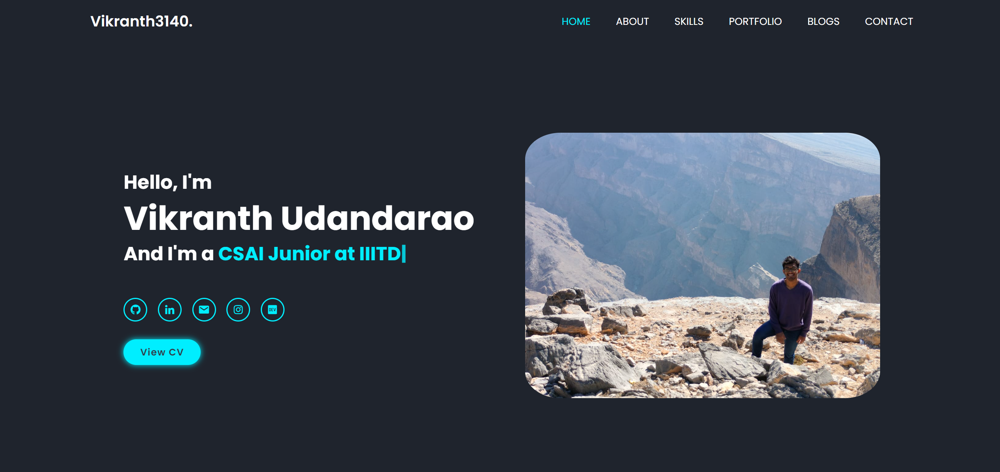
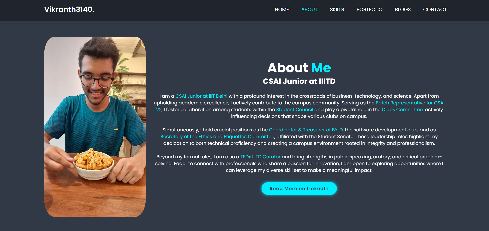

# My Portfolio

Welcome to my portfolio website, crafted with HTML, CSS, Bootstrap, JavaScript, Boxicons, ScrollReveal, and Typed.js.

Check it out at [vikranth3140.github.io](https://vikranth3140.github.io/)

This website showcases my projects, skills, and how to get in touch. Here's what you'll find:




- <b>Home:</b> A brief introduction and links to my social media profiles.
- <b>About:</b> Learn more about my background, interests, and experiences.
- <b>Skills:</b> Discover the programming languages, tools, and technologies I'm proficient in.
- <b>Portfolio:</b> Dive into my projects with descriptions and links to their GitHub - repositories.
- <b>Contact:</b> A convenient form for visitors to send messages directly to me.

## Technologies Used

- HTML
- CSS
- JavaScript
- Typed.js, ScrollReveal, Boxicons

## Setup

1. Clone the repository: 
    ```bash
    git clone https://github.com/Vikranth3140/Vikranth3140.github.io
    ```

2. Open `index.html` in a web browser to view the website locally.

## Usage

Feel free to fork this repository to create your own portfolio website!

If you decide to use this template, please provide attribution by linking back to this repository.

## License

This project is licensed under the [MIT License](LICENSE).
